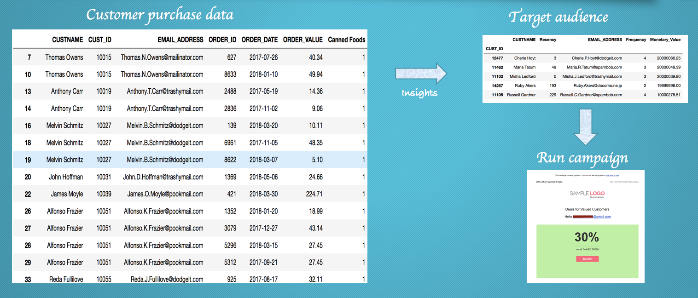
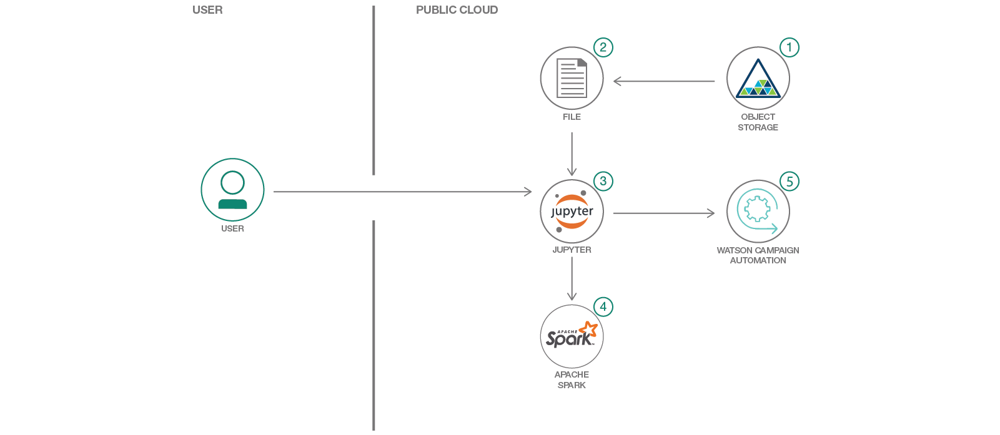

# Determine target consumers and run marketing campaigns

A business runs marketing campaigns promoting products that can lead to purchases and boost revenues. 

There are two steps to running a marketing campaign:

* Identifying the target audience - The target audience can be determined by analyzing the purchases and browsing history of customers.  

* Run campaigns(e-mail, sms, phone etc.) on target audience.

When the reader has completed this pattern, they will understand how to:
* Create and run a Jupyter notebook in Watson Studio.
* Use Object Storage to access data files.
* Use Python Pandas to derive insights and come up with a target audience based on the customer purchase data.
* Integrate with Watson Campaign Automation to run a campaign on the target audience.

The intended audience for this journey are Developers and Data Scientists who want to build a solution for building an end to end marketing campaign solution for a business.

1. The Object storage stores the data.
2. Data is utilized as csv files.
3. The Jupyter notebook processes the data and generates the target audience.
4. The Jupyter notebook is powered by Spark.
5. The target audience information is sent to Watson campaign automation to run campaigns.

## Included components

* [IBM Watson Studio](https://www.ibm.com/cloud/watson-studio): Analyze data using RStudio, Jupyter, and Python in a configured, collaborative environment that includes IBM value-adds, such as managed Spark.

* [IBM Cloud Object Storage](https://console.bluemix.net/catalog/infrastructure/cloud-object-storage): An IBM Cloud service that provides an unstructured cloud data store to build and deliver cost effective apps and services with high reliability and fast speed to market.

* [Watson campaign automation](https://www.ibm.com/in-en/marketplace/digital-marketing-and-lead-management): Smarter marketing automation across all digital channels, powered by Watson.

